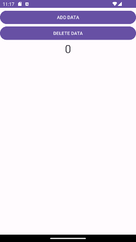

# Project 7 - Saving Data: SharedPreferences

## Overview
This Android application demonstrates the use of SharedPreferences to save and display key-value data in private mode. The main screen includes two buttons, a counter, and a list. The functionality of the buttons is as follows:

1. **Add Entry Button:** Adds the current time as a key-value pair to SharedPreferences (saved in `getDateTime.txt`). It also refreshes the interface, updating the counter and list.

2. **Remove All Entries Button:** Removes all entries from SharedPreferences and updates the interface accordingly.

The counter displays the number of elements in the list, and the list displays all entries added to SharedPreferences.

## Screenshots

### Main Screen

### Adding an Entry

### Deleting All Entries

## Implementation Details
- Data is stored in an XML file inside an inner directory: `/data/data/SharedPreferences/shared_prefs/`. Access to this directory is blocked on phones without root permission.
- Stored data remains after closing and reopening the app.

## Resources
- [Save key-value data | Android Developers](https://developer.android.com/training/data-storage/shared-preferences)
- [getDateTime.txt](getDateTime.txt)
